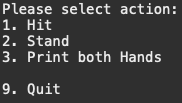

## Blackjack Project

### Description
This program is a fun and classic blackjack game. The participants are a Dealer and a Player, and they both try to reach a count of 21 without going over. The player has optional choices on how to reach 21, and the dealer has predefined set of mandates on how to proceed depending on its initial dealt blackjack hand. The program allows for one playthrough at a time.

#### Rules and Set Up
Participants: 
- 1 Dealer 
- 1 Player

Cards Count Value: 
- 1-10 = (same as face value) 
- Jacks, Queens, and Kings = 10
- Aces = 11

Rules:
1. Both participants will be dealt two cards, with 
2. The Player will be showing both, and dealer having one faced down. 
3. In the event of Blackjack (21 point count), participant wins automatically (could result in "Tie" or "Push" if both have Blackjack).
4. At any point, if a participants goes over 21, they "Bust" or loose the game.
5. Player will have to choice to "Hit" (multiple), "Stand", display hands ("Print both Hands") or "Quit" game.
6. Dealer will reveal the face-down card, and proceed to either "Hit" if hand count is 16 or less, or "Stand" if hand count is 17 or more.
7. Hand count will be evaluated, and whichever participant has 21 or closer, wins ("Tie" or "Push" if both have same hand count value).

#### Input
The Player: 
* Select an option from the Menu

#### Output
* Player and Dealer's hand
* Every card that is dealt
* Winning hand count

### Topics and Technologies Used
- Enumerated Types
- Collections and Arrays
- Classes Scope and Design

- Object-Orientated Programming ( Four Foundations )
  - Abstraction
  - Polymorphism
  - Inheritance
  - Encapsulation  

### How to Run
BlackjackApp.java contains main. Run with no arguments. 

### Notes
Just very fun to play!
